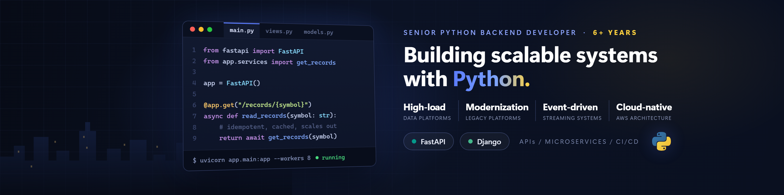

  

  
  

Hey! I'm **Yurii Zdanevych**. 👋

I'm a software developer from Ukraine 🇺🇦, currently living in Alicante, Spain 🇪🇸.

For the past 6+ years I've been building Python backends that move a lot of data: financial market data, datasets for AI and security products, bookings and payments. 🚀

Day to day that means Python, FastAPI, data pipelines, and making legacy systems fast again. But I'm curious beyond that: new domains, new problems, and new tools are what keep me going. 🌱

### 🛠 Daily stack

### 🧰 Side projects

On the side, I build tools that kill boring work:

* **[InkForge](https://github.com/Yurnerroo/InkForge)**: turns raw text and photos into a print-ready weekly newspaper by driving Adobe InDesign. 📰
* **Hardcore Ninja**: a Dota 2 custom game I started. It grew to a team of 10 developers and 500K+ Steam Workshop subscribers. 🥷

I'm open to remote roles on EU or US hours, and to relocation. ⚡️